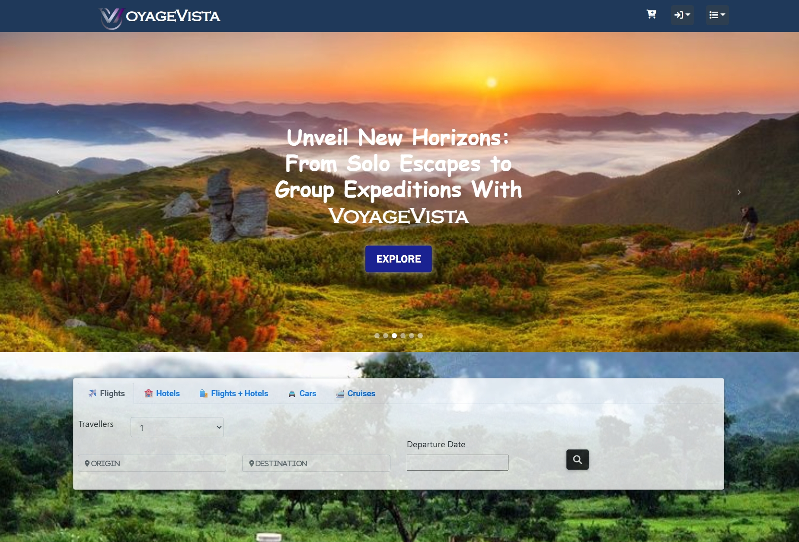

# 
VOYAGE VISTA - EXPLORE THE WORLD

## Introduction 📌
Welcome to VoyageVista, your ultimate destination for seamless international travel bookings without the burden of additional charges. Our platform is meticulously crafted to enhance your journeys, ensuring a truly effortless and global experience.

- It's Live at [VoyageVista](https://voyagevista.vercel.app/)

 

 

 

 

<h2>Demo </h2>

---

## 🛠️ Technology Stack

### Frontend

### Backend

---

 

## Contributors ✨

Gratitude is extended to these amazing individuals 💜
<table>
  <tr>
    <td align="center"><a href="https://github.com/eccentriccoder01"> <b>Sagnik Chakraborty</b></a>  <a href="#maintenance-Tlazypanda" title="Maintenance"></a> </td>

<td align="center"><a href="https://github.com/AnitSarkar123"> <b>Anit Sarkar</b></a>  <a title="Code"> </td>

<td align="center"><a href="https://github.com/YooAshu"> <b>Asghar Hussain</b></a>  <a  title="Code"> </td>
    
<td align="center"><a href="https://github.com/RuthwikReddy09"> <b>Ruthwik</b></a>    <a  title="Code"> </td>
    
<td align="center"><a href="https://github.com/Sneha123-zudo"> <b>Sneha Mishra</b></a>  <a  title="Code"> </td>

<td align="center"><a href="https://github.com/arghadipmanna101"> <b>Arghadip Manna</b></a>  <a  title="Code"> </td>
  </tr>
  </table>

## Overview ⭐
#### Key Features:

1. **Effortless Bookings:** Indulge in a smooth booking experience with our intuitive and user-friendly interface.
2. **Global Accessibility:** Discover and book flights, accommodations, and activities spanning international borders.
3. **Transparent Pricing:** Bid farewell to hidden fees and unnecessary charges for a clear and honest transaction.
4. **Streamlined Efficiency:** Save valuable time through our simplified booking process.

#### How to Navigate:

**Discover:** Explore an extensive array of destinations, flights, hotels, and activities tailored to your preferences.
**Select:** Tailor your itinerary by choosing your preferred options and personalizing your travel plan.
**Book:** Finalise your booking securely and effortlessly through our seamless platform.
**Journey:** Embark on your adventure with confidence, knowing your bookings are in capable hands.

## Issue Creation ✴
Report bugs and  issues or propose improvements through our GitHub repository.

## Contribution Guidelines 📑

- Firstly Star(⭐) the Repository
- Fork the Repository and create a new branch for any updates/changes/issue you are working on.
- Start Coding and do changes.
- Commit your changes
- Create a Pull Request which will be reviewed and suggestions would be added to improve it.
- Add Screenshots and updated website links to help us understand what changes is all about.

- Check the [CONTRIBUTING.md](CONTRIBUTING.md) for detailed steps...

    
## Contributing is fun🧡

Enhance VoyageVista with your contributions! Whether you have innovative suggestions, spot bugs, or wish to introduce new features.
Contributions of any kind from anyone are always welcome🌟❕

Your insights are invaluable to us. Reach out to our support team for any inquiries, feedback, or concerns.

Thank you for entrusting VoyageVista with your travel needs. Bon voyage❕
 
<h2>Let's start exploring </h2>

